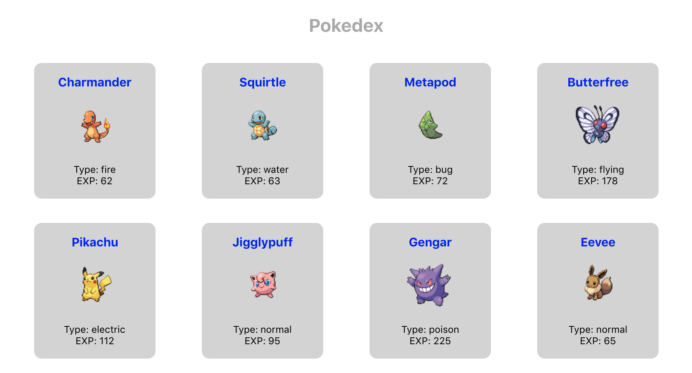
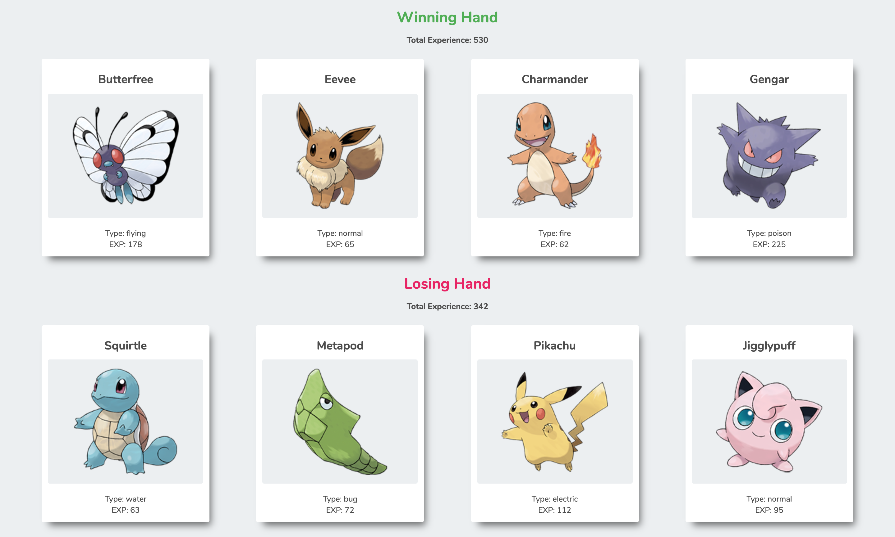

# Pokedex

### Description

This project aims to practice using React components and properties. To start it has 3 components: App, Pokedex and Pokecard.

The goal is to create a Pokemon application (a “pokedex”) that displays an interface that looks like this:

To take the exercise further the app is transformed and a new Pokegame component is created. It makes use of the Pokedex component.

The app displays a simulation of a pokegame that looks like this:

### Technologies

*Languages:* Javascript, HTML, CSS

*Library:* React

### Key features

* Display several Pokecards containing informations about Pokemons such as their name, image, type and experience
* Simulate a Pokegame using the Pokedex to display two hands of four cards, the total experience of both hands and the winner based on the highest total experience

### Poject status

The project is done.

### Credits & Sources

* Pokedex images from [PokeAPI/sprites](https://github.com/PokeAPI/sprites)

  *Use `https://raw.githubusercontent.com/PokeAPI/sprites/master/sprites/pokemon/${id}.png` and change the `id` for that of the corresponding Pokemon*
  
* Pokegame images from [another source](https://assets.pokemon.com/assets/cms2/img/pokedex/detail/001.png)

  *Use `https://assets.pokemon.com/assets/cms2/img/pokedex/detail/${id}.png` and change the `id` for that of the corresponding Pokemon. Note that the `id` for these images must be padded with zeros to three places, like: 001, 002, 034, 199, etc. Create a function to take an id like 4 and turn it into 004.*

* First small project from [The Modern React Bootcamp](https://www.udemy.com/course/modern-react-bootcamp)
